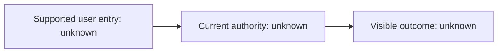

# {{PROJECT_NAME}}: Current Reality

> Generated projection. Last regenerated: {{TIMESTAMP}}. Replace only through a recovery run.

## Evidence Scope

- Repository: unknown
- Branch and SHA: unknown
- Configuration identity: unknown
- Deployed runtime identity: unknown
- Recovery scope: initial scaffold only

## Product Summary

Unknown. Recover the supported user journeys and current authority before proposing major changes.

## Authority Table

| Journey | Supported entry | Code-resolved authority | Runtime receipt | Shadow/fallback | Desired authority | Proof needed |
|---|---|---|---|---|---|---|
| Not recovered | Unknown | Unknown | Unknown | Unknown | Human decision required | Recovery |

## Architecture

## Legacy, Shadow, and Alternate Paths

- Unknown.

## Active Program

- None selected.

## Material Unknowns

- Which ordinary journey should be recovered first?
- Which component currently owns its user-visible result?
- What runtime receipt or observability exists?

## Next Human Decision

Choose the first ordinary user journey whose authority must be understood.

