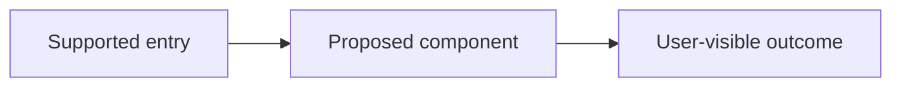

# Program: {{PROGRAM_TITLE}}

- Program ID: `{{PROGRAM_SLUG}}`
- Status: draft
- Entry mode: {{ENTRY_MODE}}
- Created: {{TIMESTAMP}}
- Last updated: {{TIMESTAMP}}
- Human direction approval: pending
- Architecture and program approval: pending
- Activation approval: pending

## User Outcome

State the observable user outcome in plain language.

## Non-goals

- List what this program deliberately will not change.

## Current Authority and Desired Authority

| Journey | Current code-resolved authority | Runtime observed | Desired authority | Retirement condition |
|---|---|---|---|---|
| <journey> | Unknown | Unknown | Human choice pending | Not defined |

## Options and Chosen Direction

### Chosen direction

Pending human choice.

### Rejected or deferred options

- None recorded.

## System Architecture

Describe components, ownership, boundaries, data/control flow, state, configuration, providers, failure boundaries, and observability.

## Program Design

### Participating modules and surfaces

| Surface | Current responsibility | Proposed responsibility | Source or rationale |
|---|---|---|---|
| Unknown | Unknown | Unknown | Recovery required |

### Contracts and call path

Define inputs, outputs, schemas, errors, versioning, idempotency, compatibility, and the complete call path without implementation bodies.

### State and failure behavior

Define state transitions, retries, timeouts, cleanup, resume, rollback, and user-visible errors.

### Observability and test seams

Define receipt fields and where deterministic, integration, runtime, API, browser, visual, and human evidence attach.

## Uncertainty Analysis

| Assumption or question | Type | Cost if false | Existing evidence | Smallest discriminator | Route | Exit criterion |
|---|---|---|---|---|---|---|
| <question> | behavior | Unknown | None | Recover current journey | characterization | Authority table is source-linked |

## Route Decisions

For each material slice, record `run`, `skip`, `loop`, or `defer`, why, and the evidence used. Do not choose tracer bullet automatically.

## Proof Obligations

| ID | Requirement | Cheapest falsifying evidence | Forbidden observation | Evidence level | Status |
|---|---|---|---|---|---|
| PO-001 | <requirement> | <observation> | <forbidden result> | runtime | proposed |

## Bounded Slices

| Slice | Outcome | Route and why | Owner | Allowed scope | Dependencies | Proof | Stop condition |
|---|---|---|---|---|---|---|---|
| S-001 | <outcome> | undecided | one owner | <paths> | <preconditions> | PO-001 | <condition> |

## Activation, Rollback, and Legacy Retirement

- Activation condition:
- Human activation gate:
- Rollback method and trigger:
- Migration/data compatibility:
- Negative reachability requirement:
- Legacy state: deleted | isolated for rollback | intentionally retained
- Legacy owner and retirement condition:

## Human Gates

| Gate | Decision | Evidence presented | Status |
|---|---|---|---|
| Direction | Choose product direction | Options and research | pending |
| Program | Approve architecture, program design, routes, and proof | This document | pending |
| Activation | Transfer authority | Real journey receipt and falsification | pending |

## Open Questions

- List only questions that can change direction, architecture, authority, or acceptance.

## Evidence Index

| Evidence | SHA/configuration | Claim supported | Location |
|---|---|---|---|
| None | Unknown | None | None |

