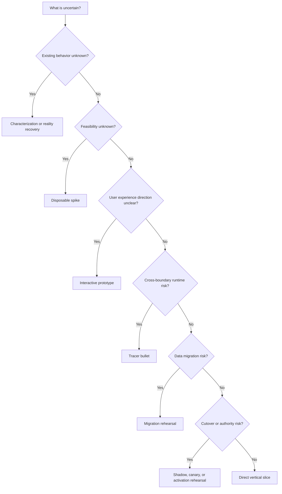

# Gate Routing

Use this guide whenever the next activity is not obvious. The purpose is to reduce uncertainty, not to satisfy a fixed process.

## Mandatory questions

Record one route note containing:

| Field | Question |
|---|---|
| Decision enabled | What future decision needs better evidence? |
| Existing evidence | What already answers it, and at what confidence? |
| Cost of being wrong | What fails if the assumption is false? |
| Cheapest discriminator | What is the smallest observation that would change the decision? |
| Route | Run, skip, loop, or defer |
| Exit criterion | What result is enough to proceed or stop? |

Do not run an activity merely because it appears in a workflow diagram. Do not skip a material question merely because the answer feels likely.

## Route selection

### Characterization or recovery

Use when the current behavior, authority, data ownership, or ordinary journey is not known. Produce observations and executable characterization, not a redesign.

### Research

Use when prior art, adoption choices, current APIs, market conventions, or failed approaches can materially change the direction. Distill findings before they reach the architect.

### Interactive prototype

Use when the human cannot choose confidently from prose. Build disposable HTML options with realistic interaction and content. Keep them outside production code and block accidental transition to implementation.

### Disposable spike

Use for a narrow feasibility question. Time-box it. It may use rough code or isolated experiments, but it must not silently become production code. End with yes, no, or inconclusive plus evidence.

### Tracer bullet

Use when the risky uncertainty crosses real boundaries such as UI, API, queue, worker, database, provider, storage, or runtime configuration.

Implement the minimum real parts necessary to test the risky assumptions. Fake or bypass everything else. Label fakes, state which claims they cannot prove, and delete or isolate them after learning.

### Vertical slice

Use when feasibility and interfaces are well understood. Deliver the smallest real user-visible outcome through the actual architecture with normal production quality.

### Migration rehearsal

Use representative copied data and the real migration procedure. Prove repeatability, rollback, and compatibility without risking the authority source.

### Shadow, canary, or activation rehearsal

Use when both old and new paths exist or a new path may take authority. Require shared receipts and negative-reachability checks. A shadow result cannot prove the new path owns the user-visible result.

## Skip and loop rules

- Skip with a recorded reason and evidence pointer, not with silence.
- Loop back when evidence invalidates architecture, product intent, or a prior assumption.
- Defer when only the human can choose, an external dependency is unavailable, or the required proof would exceed authorization.
- Prefer the shortest route that can change the decision.
- Escalate evidence strength with consequence. A parser change may need unit evidence; a cutover needs an ordinary journey and authority receipt.

## Human questions

Ask one focused question only when different answers would materially change the product, architecture, authority, destructive action, or acceptance contract. Otherwise state a reversible assumption and continue.

