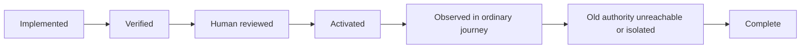

# Proof and Activation

Proof asks: what evidence would convince us the requirement is true, and what is the cheapest observation that could show it is false?

## Evidence levels

| Level | Useful for | Does not prove alone |
|---|---|---|
| Deterministic | Parsers, transformations, validators, state machines, business rules | Real routing or deployed behavior |
| Integration | Service, database, queue, worker, provider, and fixture boundaries | Supported browser journey or active authority |
| Runtime path | Lane, stages, SHA, configuration, fallback, artifact provenance | UX quality by itself |
| API | Actual request/response and persisted record | Browser navigation and usability |
| Browser/UX | Supported entry, clicks, uploads, waits, network, visible outcome | Internal lane unless paired with receipt |
| Visual | Layout, clipping, readability, broken states | Semantic correctness |
| Human | Product value, aesthetic quality, activation decision | Repeatable machine regression proof |

Choose the cheapest level that proves the claim. High-consequence cutovers usually need runtime path plus ordinary API/browser journey and human activation.

## Test classes

- **Characterization:** passes before and after; preserves current behavior that must remain.
- **Acceptance:** fails before and passes after; proves the requested change happened.
- **Negative reachability:** blocks release if a retired or forbidden path becomes reachable.

Label tests by class. `All tests pass` is not meaningful without knowing which claims the suite covers.

## Journey receipt

Capture at least:

- Run, request, user journey, and artifact identity
- Canonical lane or pipeline identity
- Code SHA and resolved configuration identity
- Stages actually executed
- Legacy fallback or alternate path used
- Start, finish, outcome, and error
- Data/provider identities safe to disclose
- Evidence links: logs, API transcript, database query, screenshot, verifier report

Prove today's known path with the receipt before trusting it to prove a future path.

## Falsification handoff

Give the verifier:

- Approved program and proof obligations
- Base revision and candidate diff
- Required environment and fixture
- Claimed evidence
- Known protected and forbidden paths

Do not provide the implementer's reasoning transcript. The verifier's goal is to falsify, not to confirm.

Try alternate supported entries, direct APIs, stale or missing flags, fresh and existing data, restart, mid-run failure, retry/resume, legacy routes, alternate readers, and SHA/config mismatches.

Return exactly one state per obligation:

- `passed`: required observation exists and forbidden observation does not.
- `failed`: a forbidden observation or missing required outcome is evidenced.
- `inconclusive`: the environment, observability, or evidence cannot decide.

If only the implementer can review, label the result `self_review`. Harness or model diversity is useful only when real; do not invent it.

## Real product journey

Start the actual services, seed representative data, call the real API, inspect persistence, use the supported browser route, complete the user action, capture logs/network/screenshots, and compare the receipt to the visible artifact. Adapt this list to the claim; do not force irrelevant evidence.

## Activation ladder

Before activation, the human reviews target evidence, migration compatibility, rollback method and trigger, negative reachability, and known unknowns.

A legacy path must be deleted, isolated for a named rollback window, or intentionally retained with a supported use, owner, and retirement condition. Merely leaving it able to serve the ordinary journey is failure.

