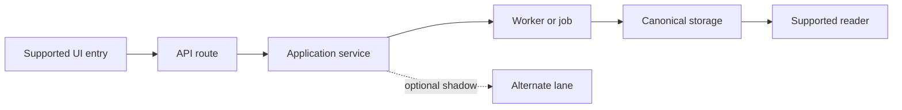

# Current Reality Recovery

Recover enough reality for the human and agents to make the next decision safely. Do not attempt a line-by-line encyclopedia of the repository.

## Recovery sequence

1. Read repository instructions and preserve the current worktree.
2. Record repository, branch, HEAD, dirty state, relevant configuration, and available runtime evidence.
3. Identify the product's ordinary user journeys and entry points.
4. Trace each selected journey through UI, API, application services, jobs/workers, storage, providers, and rendered output.
5. Identify current authority: which path owns the returned or persisted result?
6. Inventory legacy, shadow, experimental, fallback, and alternate paths.
7. Separate code-resolved behavior from deployed runtime behavior.
8. Locate observability: logs, traces, run records, artifacts, metrics, and receipts.
9. Inspect tests by claim type: characterization, acceptance, and negative reachability.
10. Generate `.project-factory/brain/NOW.md` with source links, confidence, unknowns, and drift.

## Evidence labels

Use these exact meanings:

| Label | Meaning |
|---|---|
| Source fact | Directly visible in a named file, diff, configuration, or command result |
| Code-resolved | The inspected code/configuration selects this path at the stated SHA |
| Runtime observed | A real execution produced a receipt, log, persisted record, network trace, or artifact |
| Human intent | The owner selected this direction; it may not exist yet |
| Inference | The conclusion follows from evidence but was not directly observed |
| Unknown | Evidence is unavailable, contradictory, stale, or outside scope |

Never write `runtime observed` when only code was inspected. If deployment identity is unavailable, say `deployed runtime unknown`.

## Authority table

Create a compact table for the journeys that matter:

| Journey | Supported entry | Code-resolved authority | Runtime receipt | Shadow/fallback | Desired authority | Proof needed |
|---|---|---|---|---|---|---|

Authority means the component or lane that owns the user-visible return value or canonical persisted result. A path that runs in shadow but cannot own the result is not the active authority.

## Architecture map

Include a source-linked Mermaid diagram showing real components and call direction. Mark unknown or conditional edges clearly.

Do not invent names such as V1 or V2 when the repository uses conflicting labels. Use neutral names until the human chooses canonical terminology.

## Recovery quality checks

- Every material claim names a file, command, commit, receipt, or explicit inference.
- Current SHA and configuration scope are visible.
- Ordinary and experimental entry points are not conflated.
- Returned authority and merely executed shadow work are distinguished.
- Deleted files are distinguished from files simply absent from a patch.
- Open pull requests are distinguished from deployed behavior.
- Tests are mapped to the claims they can prove.
- Unknowns are explicit and prioritized by decision impact.
- The human can explain the selected journey after reading `NOW.md`.

## Stop condition

Recovery is complete enough when the next product or architecture decision no longer depends on a high-impact unknown. If it still does, route to targeted research, characterization, instrumentation, or a human question.

