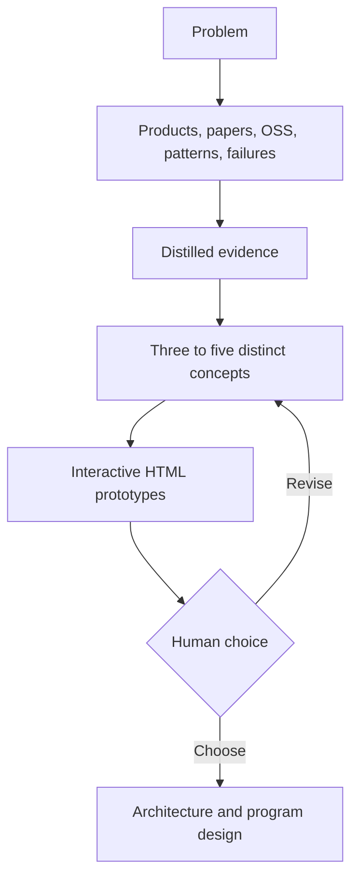

# Research and Exploration

Research is a decision service, not a context dump. Use it only when external knowledge can change build, adopt, adapt, or product-direction choices.

## Defined-outcome research

Ask a narrow question, such as whether a mature component already solves the risky part. Search current primary sources, inspect representative implementations, test adoptability where cheap, and return a compact recommendation.

## Exploration mode

Use when the human knows the problem but not the right product:



Exploration may produce research, diagrams, screenshots, and disposable prototypes. It may not change production code unless the human explicitly chooses a direction and authorizes implementation.

## Research claim contract

Record each material finding as:

```text
CLAIM
The concrete conclusion.

SOURCE
Primary URL, paper, repository, or direct experiment.

CONFIDENCE
High, medium, or low.

RELEVANCE
Which project decision it changes.

ADOPTABILITY
Adopt, adapt, learn from, reject, or unknown.

VERIFIED
What was actually inspected or executed.

NOT VERIFIED
What remains unknown.
```

A repository's existence is not evidence of suitability. Prefer current official documentation, primary research, source code, release history, and a small local pilot over popularity claims.

## Distillation boundary

Researchers may inspect many sources. The architect receives a 2,000 to 5,000 token brief containing conclusions, citations, disagreements, and open questions, not the full research journey.

Store project-specific findings with the active program. Promote a finding to a cross-project knowledge library only after repeated reuse justifies maintenance. Current code and runtime evidence always outrank remembered research.

## Concept quality

Concepts must be meaningfully different, not palette variations. For each concept include:

- User promise and primary workflow
- Interaction model
- System implications
- What it deliberately does not solve
- Evidence supporting it
- Main risk and cheapest validation
- Adopt/adapt/build implications

Generate interactive HTML only when interaction will help the human choose. Use realistic content, not fake metrics or vague marketing copy.

## Human choice record

When the human chooses, append to `DECISIONS.md`:

- Chosen concept and why
- Alternatives rejected and why
- Evidence considered
- Assumptions accepted
- Revisit trigger

Then create architecture and program design. Do not let a prototype become the production spec without an explicit choice.

