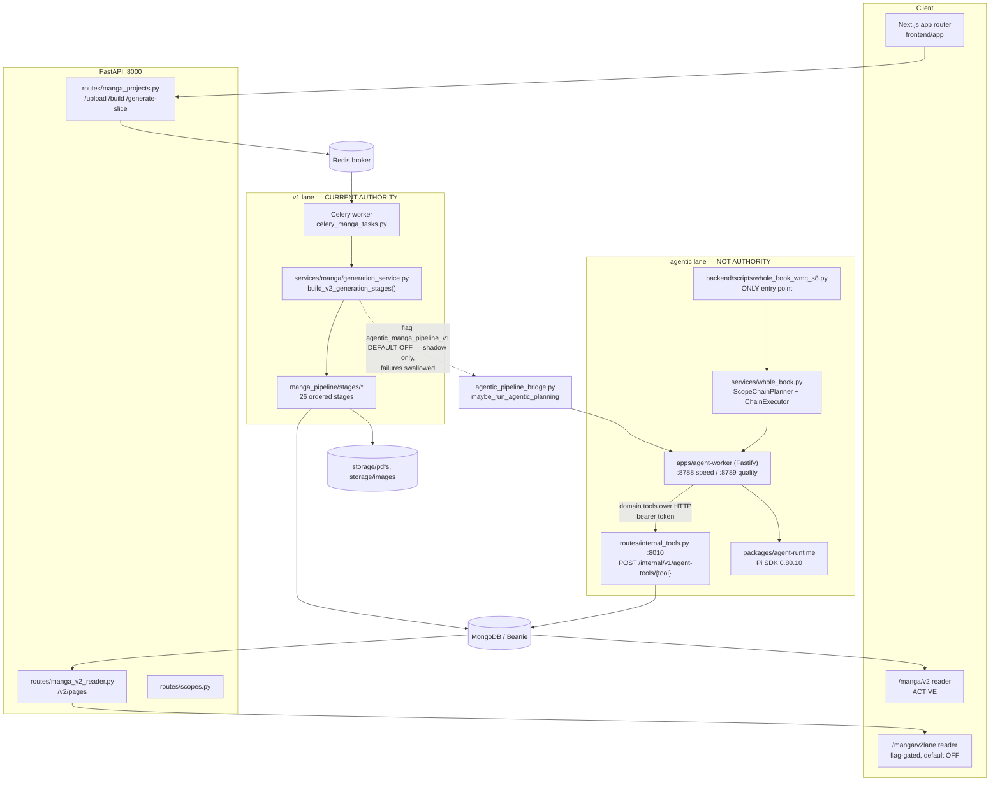
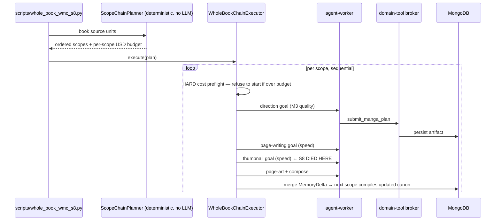

# PanelSummary / Book-Reel: Current Reality

> Generated by a recovery run on 2026-08-10. Entry mode: **recovery only** (explain
> architecture, program design, issue #15, and the `v2-architecture` branch — no
> implementation requested, none performed). Replace only through another recovery run.

## Evidence Scope

- Repository: `Legend101Zz/PanelSummary` (working copy `/Volumes/Mrigesh SSD/Book-Reel`)
- Branch and SHA: `v2-architecture` @ `47ea74df3553e3ee7d497affa5f95fc215deab34`
- Worktree: clean except untracked `.agents/`, `.claude/` (tooling, not product)
- Configuration identity: **defaults as declared in `backend/app/config.py`**. No `.env`
  was read and no service was started, so the *resolved* runtime configuration of any
  running instance is `unknown`.
- Deployed runtime identity: **unknown**. Nothing was executed during this recovery.
- Live database state: **unknown**. Issue #15 records an owner-requested wipe on
  2026-08-09 (backup at `.dev/db-backups/panelsummary-pre-wipe-20260809/`); not verified.
- Recovery scope: the manga-generation product path end to end, both lanes, plus the
  branch delta `main...v2-architecture`.

### Human-facing views

Three hand-written views carry this recovery for reading. They are linked to each other and
back to the control room:

| View | Covers |
|---|---|
| `views/recovered-architecture.html` | Lanes, authority, runtime components, the issue-#15 verification table, the deprecation path |
| `views/recovered-program-design.html` | Call stacks for both lanes, the trust boundary, state machines, failure mechanisms, test seams, and what a real `PROGRAM.md` would add |
| `views/recovered-agentic-lane.html` | The agentic lane in depth: the nine-artifact chain, the six agent goals, the sealed worker, context budgeting, memory versioning, page-art gates, eval, model policy, and the mode-to-worker wiring gap |

The generated `views/architecture.html` and `views/program-design.html` are intentionally
empty: both render from a `PROGRAM.md` (`project_factory.py:709`), and no program exists
because no direction decision was requested. A `PROGRAM.md` designs a *change*; these views
describe the *system*.

### Evidence labels used below

`Source fact` · `Code-resolved` · `Runtime observed` · `Human intent` · `Inference` · `Unknown`

Nothing in this file is labeled `Runtime observed` on the basis of my own execution. Where
receipts exist they are **historical** — produced by earlier sessions at earlier SHAs and
committed under `docs/evidence/`.

---

## Terminology (adopt the owner's naming — the repo's labels conflict)

The repository uses "v2" for three unrelated things. Issue #15 fixes this; this file uses
the issue's names verbatim.

| Name used here | What it actually is | Where |
|---|---|---|
| **v1 lane** | The classic Celery + typed-stage pipeline. Confusingly includes the function `build_v2_generation_stages()` and the reader route `/manga/v2`. "v2" there means *second-generation stage chain of the classic pipeline*. | `backend/app/manga_pipeline/`, `backend/app/services/manga/generation_service.py`, `frontend/app/books/[id]/manga/v2/` |
| **agentic lane** | The new architecture: Pi-SDK agents + typed cross-language contracts + domain-tool broker. | `apps/agent-worker`, `packages/*`, `backend/app/services/manga_director.py` etc., `frontend/app/books/[id]/manga/v2lane/` |
| **`v2-architecture` branch** | The git branch carrying the agentic-lane port (PR #14, open). Not a lane. | this branch |

`Source fact` — `backend/app/services/manga/generation_service.py:212`,
`frontend/app/books/[id]/manga/v2lane/page.tsx:3-9`, issue #15 "Naming note".

---

## Product Summary

PanelSummary turns an uploaded PDF into a source-grounded manga adaptation: parse the book,
create a manga project, run a global book-understanding pass, generate source slices, persist
`RenderedPage` documents, read them in the manga reader.

Legacy summary, living-panel, and reel surfaces are not active product surfaces
(`CLAUDE.md`; `Human intent`). The reel lane exists as contracts and an issue (#9) only.

---

## Authority Table

Authority = the lane that owns the user-visible return value / canonical persisted record.

| Journey | Supported entry | Code-resolved authority | Runtime receipt | Shadow / fallback | Desired authority | Proof needed |
|---|---|---|---|---|---|---|
| Upload + parse PDF | `POST /upload` | v1 lane — `parse_pdf_task` → `Book` | Historical (v1 WMC run, owner-reported) | none | unchanged | none |
| Create manga project | `POST /books/{id}/manga-projects` | v1 lane — `MangaProjectDoc` | historical | none | unchanged | none |
| Book understanding | `POST /manga-projects/{id}/book-understanding` | v1 lane — `book_orchestrator.py` | historical | none | agentic (proposed, Phase 4) | side-by-side judging |
| **Generate manga (the product)** | `POST /manga-projects/{id}/build` → `build_manga_project_task`; or `POST .../generate-slice` | **v1 lane** — `build_v2_generation_stages()`, 26 ordered stages | Historical: full WMC book, 8 slices / 32 pages, 2026-08-09, ~$0.95 (owner-reported in #15; not re-verified) | agentic planning runs **shadow-only** behind `agentic_manga_pipeline_v1`, default OFF | agentic lane (proposed, owner-gated) | one full book generated by the agentic lane alone + preferred in side-by-side judging |
| Read manga | `/books/{id}/manga/v2` | v1 lane — `MangaPageDoc.rendered_page` → `MangaPageRenderer` | historical (screenshots under `docs/renderer-analysis/`) | `/manga/v2lane` reader exists, gated by `NEXT_PUBLIC_MANGA_V2_LANE_READER` | agentic reader (proposed, Phase 4) | browser journey on agentic pages |
| Character library | `GET /manga-projects/{id}/assets` | v1 lane | historical | none | unchanged | none |
| **Whole-book agentic run** | **none — no route, no Celery task, no UI** | **no production authority** | Historical, and it **failed**: `docs/evidence/session8-golden-run/chain_outcome.json` → `status: "stopped_failure"` | script-only: `backend/scripts/whole_book_wmc_s8.py` | production entry point (proposed, Gap 3) | one scope completing direction → page-writing → thumbnails → page-art |

### The single most important fact

**Every user-visible manga output today is produced by the v1 lane.** `Code-resolved` at
`47ea74d`:

- `use_compiled_context: bool = False` — `backend/app/config.py:83`
- `agentic_manga_pipeline_v1: bool = False` — `backend/app/config.py:111`
- The `/build` handler accepts no `lane` parameter and queues `build_manga_project_task`
  unconditionally — `backend/app/api/routes/manga_projects.py:672-757`
- `WholeBookChainExecutor` has **no non-test, non-script caller** — verified by grep; the
  only references are `whole_book.py:493` (definition), `backend/tests/test_whole_book_v2.py`,
  and `backend/scripts/whole_book_wmc_s7.py` / `_s8.py`.

This is deliberate, not an oversight (ADR-011/012: never risk v1).

---

## Architecture

### Runtime components

`Source fact` for every box: files named in the diagram. `Code-resolved` for the edge
labels (flag defaults read at `config.py:83,111`; shadow semantics at
`generation_service.py:653-670`).

### The v1 lane (current authority)

`generate_project_slice` (`generation_service.py:~430-700`) runs an ordered stage list built
by `build_v2_generation_stages()` (`:212-280`). The chain, in order:

`source_fact_extraction → adaptation_plan → character_world_bible → beat_sheet →
manga_script → script_review → script_repair → storyboard → dsl_validation →
continuity_gate → quality_gate → [deterministic grounding repair → dsl_validation →
continuity_gate → quality_gate] → quality_repair → [same repair triple again] →
quality_assert → page_composition → rtl_composition_validation → vector_scene →
character_asset_plan → rendered_page_assembly → (optional panel_rendering →
panel_quality_gate)`

The repair/check triple repeats three times by design: the free deterministic pass runs
before any paid editor rewrite (`:242-256`). Output is `MangaSliceDoc` +
`MangaPageDoc.rendered_page` — `RenderedPage` is the contract boundary between backend and
reader.

### The agentic lane (ported, not authoritative)

Three layers, all present on this branch:

1. **Typed contracts** — `packages/contracts/schema/*.json` (~35 schemas: `manga_plan.v1`,
   `page_script_set.v1`, `thumbnail_set.v1`, `page_art.v1`, `compiled_layout.v1`,
   `context_pack.v1`, `model_receipt.v1`, `eval_scorecard.v1`, …) generated into both
   TypeScript (`src/generated/`) and Python (`backend/app/contracts/`), with canonical,
   invalid, and prompt-injection fixtures in `packages/fixtures/`. This is the cross-language
   spine — the same JSON validates on both sides.
2. **Agent plane** — `apps/agent-worker` is an authenticated Fastify service
   (`POST /internal/v1/agent-runs`, `GET/POST /internal/v1/agent-runs/{id}`) wrapping
   `packages/agent-runtime` (the only package importing the Pi SDK, pinned at
   `@earendil-works/pi-coding-agent 0.80.10` per ADR-003/012). Two instances run in dev: a
   speed worker (`MiniMax-M2.7-highspeed`, :8788) and a quality worker (`MiniMax-M3`, :8789)
   — `start.sh:6-13`.
3. **Domain-tool broker** — agents never touch Mongo. They call back over HTTP into
   `backend/app/api/routes/internal_tools.py`
   (`POST /internal/v1/agent-tools/{tool_name}`, :8010) which fronts
   `services/domain_tools.py` and `services/page_domain_tools.py` with per-goal allowlists
   (ADR-004). This is the trust boundary: the agent's only capability is the tool list it
   was granted.

**Control flow of one agentic scope** (`Code-resolved`, `services/whole_book.py`):

Resume is structural, not bolted on: scope ids are content hashes (`create_scope` is
get-or-create), stage drivers reuse succeeded stages by idempotency key, and the memory
merge is guarded by `memory_version` so re-runs cannot double-merge
(`whole_book.py:25-32`). The S8 receipt shows this working — `reused_stages:
["manga_direction","manga_page_writing"]` at $0 on resume.

### Durable context bridge (the safety mechanism worth understanding)

`use_compiled_context` does not change output when enabled. It builds slice text from a
compiled `ContextPack` and then **byte-compares it against the legacy builder, raising on
any mismatch** (`generation_service.py:459-478`). Flag-on cannot silently alter generated
output; it can only crash loudly. That is ADR-011's design and it is what makes Phase 1 of
the deprecation plan cheap to attempt.

Likewise the shadow hook: `maybe_run_agentic_planning` runs *after* a successful v1 slice,
writes only agentic-lane rows, and logs-and-swallows every failure
(`generation_service.py:653-670`). It supplements v1; **it structurally cannot replace it.**

---

## Program Design (as built)

Full detail — call stacks, sequence diagrams, state machines, failure mechanisms, test
seams — is in `.project-factory/views/recovered-program-design.html`. The generated
`views/program-design.html` is empty by design: it renders from
`brain/programs/<slug>/PROGRAM.md` (`project_factory.py:709`), and no program exists
because no direction decision has been recorded. A `PROGRAM.md` designs a *change*; the
table below and that view describe the *system*.

### Call path summary

**v1 lane, one build:** `POST /build` (`routes/manga_projects.py:672`) → `JobStatus` insert
→ Redis → `build_manga_project_task` (`celery_manga_tasks.py:44`) → `generate_book_understanding`
if needed → loop `generate_project_slice` → `_pick_next_slice` → `build_source_text_for_slice`
→ optional compiled-context byte-compare (`generation_service.py:459-478`) →
`build_v2_generation_stages()` (`:212`) → `run_pipeline_context` (`orchestrator.py:33`)
runs the ordered list → persist `MangaSliceDoc` + `MangaPageDoc[]` → update ledger/coverage
→ optional shadow hook (`:653`) → `update_job_status` (`celery_worker.py:137`) → UI polls
`/status/{task_id}`.

**Agentic lane, one scope:** script → `WholeBookChainExecutor.execute` → budget preflight →
`MangaDirectorService.run_direction_goal` (`manga_director.py:149`) → compile `ContextPack` →
`_ensure_run_and_stage` (content-hash key) → reuse check → `HttpAgentWorkerClient.run`
(`agent_worker.py:74`) → `POST /internal/v1/agent-runs` → `RunRegistry.start` (goal_id dedupe)
→ Pi runtime → agent calls `POST /internal/v1/agent-tools/{tool}` (`internal_tools.py:48`) →
broker validates + persists candidate → **driver re-reads the candidate from Mongo and
verifies run_id/project_id/validation_status/content_hash before accepting**
(`manga_director.py:221-237`) → mint accepted artifact + `ModelReceipt` → page-writing →
thumbnail → page-art → eval → version-guarded `MemoryDelta` merge.

### Key mechanisms

- **The driver does not trust the agent's return value.** The authority is the durable record
  the broker wrote through the validators. Same pattern in `manga_page_planner.py:311,:472`
  and `manga_page_art_stage.py:1315`.
- **Resume has no subsystem.** It falls out of three content-hash decisions: scope ids
  (`whole_book.py:661-686`), stage keys (`content_hash({run_id, stage, attempt})`), and the
  `memory_version` merge guard (`:688-706`).
- **Failed-attempt spend is charged as a delta** so a resume never re-bills prior failures
  (`whole_book.py:588-593, :640-651`).
- **Transport-fallback text lane:** after one mangled tool-frame rejection the agent emits a
  bare JSON final message; the runtime recovers it (`candidate-fallback.ts`, `pi-runtime.ts:254-272`)
  and pushes it through the *same* authenticated tool and validators.
- **Free repair before paid repair** in v1 (`generation_service.py:242-256`).

| Area | Reality at `47ea74d` |
|---|---|
| Participating surface | FastAPI (`:8000`) + broker (`:8010`) + Celery + Redis + MongoDB/Beanie + Next.js (`:3000`) + two agent workers (`:8788`/`:8789`) + local `storage/` |
| Contracts | v1: `RenderedPage` (`backend/app/domain/manga/render_view.py` ↔ `frontend/lib/types.ts`). Agentic: ~35 versioned JSON Schemas in `packages/contracts/schema/`, code-generated to TS + Python, fixture-tested both sides |
| Call path (v1) | UI → `POST /build` → `JobStatus` + Celery task → `generate_project_slice` → 26 stages → `MangaSliceDoc`/`MangaPageDoc` → `GET /pages` → reader |
| Call path (agentic) | script → `ScopeChainPlanner` → `WholeBookChainExecutor` → `POST /internal/v1/agent-runs` → Pi agent → `POST /internal/v1/agent-tools/{tool}` → Mongo artifacts → `GET /v2/pages` → `/manga/v2lane` |
| State transitions | v1: `JobStatus` (pending/progress/success/failure) + `MangaProjectDoc.status` + `continuity_ledger` + `last_failure` (informed resume, added `0fc2515`). Agentic: `GenerationRun`/`StageRun` documents keyed by idempotency hash |
| Failure behavior | v1: ledger-based resume, live-proven. Agentic: preflight refusal before spend, stop-on-first-failure, resume by stage reuse — proven per-stage, **never exercised mid-book** |
| Observability | v1: `JobStatus` polling + `/tmp/panelsummary-celery.log`. Agentic: `ModelReceipt`/`ProviderReceipt` per call (model, mode, provenance, USD), `chain_outcome.json`, and an optional verbatim pre-normalization seam dump (`agent_seam_raw_dump_dir`, `config.py:113-125`) |
| Test seams | `backend/tests/` (`test_whole_book_v2.py` proves planner + executor + resume against **stub runners**), `packages/contracts/test/fixtures.test.ts` (cross-language fixture validation), `packages/agent-runtime/test/` (injection, policies, model selection), `apps/agent-worker/test/` |
| Cost policy | Every text/vision call goes through server-owned `MINIMAX_API_KEY`; OpenRouter is image-only. Per-purpose model modes are config, not code: direction=quality, page_writing=speed, thumbnail=speed (`config.py:87-101`) |

---

## Issue #15 — Verification Status

Issue #15 is the owner's evidence-backed answer to "why did the 2026-08-09 full-book manga
use v1, is the agentic lane usable, and what is the v1 deprecation plan?" I re-checked its
load-bearing claims against the working tree.

| #15 claim | My verification | Label |
|---|---|---|
| Both gate flags default OFF (`config.py:83`, `:111`) | Confirmed, exact lines | `Code-resolved` |
| Flag-ON is shadow only; failures swallowed (`generation_service.py:653`) | Confirmed at `:653-670` | `Code-resolved` |
| No production entry point for a full agentic book | Confirmed — grep finds only tests + `scripts/whole_book_wmc_s{7,8}.py`; `/build` has no `lane` param | `Code-resolved` |
| Golden chain has never completed one full scope | Confirmed by the committed receipt: `chain_outcome.json` → `status: "stopped_failure"`, scope 0 `status: "failed"`, `thumbnail_artifact_id: null`, `error: "AgentWorkerError: Agent worker returned HTTP 422"`, with direction + page-writing reused at $0 | `Runtime observed` (historical, earlier SHA) |
| Thumbnail stage is the wall, on speed-model schema flailing | Consistent: 10+ `validate_layout_draft` raw dumps for a single thumbnail stage_run in `session8-golden-run/raw_dumps/` before one `submit_thumbnail_set` | `Runtime observed` (historical) + `Inference` on the cause |
| Text spend $0.094 of a $0.90 grant; images $0 | Confirmed in the receipt | `Runtime observed` (historical) |
| DB wiped 2026-08-09, backup path given | Not verified — no DB access this session | `Unknown` |
| "817 backend + 47/22/16 TS tests green", per-session dollar figures, WMC run cost $0.95 | Not re-run | Owner-authored claim |
| Fidelity is 1/5; constraint is claims **density** in page-writing | Not independently assessable | `Human intent` / owner judgment |

**Drift note:** HEAD carries three commits made *after* issue #15 was filed —
`d3e0790` (real page provenance from docling, skip textless page windows), `0fc2515`
(informed resume for v1 builds), `47ea74d` (dev-stack stdin fix). None touches the two gate
flags or adds an agentic entry point, so #15's gap list still holds — but #15 does not
describe HEAD byte-for-byte.

### The nine gaps, grouped by what actually blocks what

- **Blocks any agentic run at all:** Gap 1 (thumbnail capability wall — owner must price
  `AGENT_MODEL_MODE_THUMBNAIL=quality`, ~$0.09–0.16/resume) → Gap 2 (one completed golden
  scope, ~$0.25).
- **Blocks a UI-triggered run:** Gap 3 (wire `WholeBookChainExecutor` to a Celery task +
  `lane` option on `/build`, progress into `JobStatus`) and Gap 4 (turn on
  `use_compiled_context`, wire book normalization into upload/build).
- **Blocks *promotion*, not execution:** Gap 5 (page-writing claim density — the chain would
  run but lose a side-by-side against v1 today). This is the real product risk.
- **Cost/robustness:** Gap 6 (page-art at book scale, ~$1.30/32 pages via lane B),
  Gap 7 (mid-book kill-and-resume never exercised), Gap 8 (M3 truncated-JSON ceiling),
  Gap 9 (reader/UX parity).

Ordering follows from that grouping: 1 → 2 unblocks the mechanism; 5 retires the quality
risk for free while in shadow; 3+4 buy the button. Estimated first full-book agentic WMC
run once 1–4 close: **~$3–4** vs v1's ~$0.95 (owner-authored estimate from receipted
actuals).

---

## How the `v2-architecture` Branch Works

`Source fact`: `git diff --stat main...v2-architecture` → **428 files, +82,952 / −279**.
Deletions are near-zero on purpose — this is a *port beside* v1, never a rewrite of it.

**What the branch adds:**

- `pnpm-workspace.yaml` + `tsconfig.base.json` — the repo becomes a Python backend **plus**
  a pnpm TS workspace.
- `packages/contracts` — JSON Schemas → generated TS + Python types.
- `packages/fixtures` — canonical / invalid / prompt-injection fixtures, cross-validated in
  both languages.
- `packages/agent-runtime` — the sole Pi-SDK boundary (ADR-003), plus model-selection and
  candidate-fallback policy.
- `apps/agent-worker` — the authenticated Fastify agent host and repo-owned skill markdown.
- Backend agent plane — `services/{manga_director,manga_page_planner,manga_page_art,
  whole_book,context_compiler,memory,scopes,source_units,model_policy,domain_tools,
  agent_worker,agentic_pipeline_bridge,compiled_context_bridge}.py`, `app/contracts/`,
  `api/routes/{internal_tools,scopes,manga_v2_reader}.py`.
- `docs/adr/001`–`012`, `docs/evidence/session2…session8`, `docs/research/`.
- `start.sh` / `check.sh` / `stop.sh` — one-command dev stack: Redis, FastAPI, Celery,
  Next.js, broker, and both agent workers.

**Governing rules of the port** (`Human intent`, ADR-010/011/012):

1. *Port verbatim from the donor, enumerate every boundary edit.* Donor pinned at
   ScrollStack `main @ 43300b5`.
2. *v1 is never at risk.* Every new path is behind a default-OFF flag; the compiled-context
   path byte-compares and raises rather than diverging.
3. *Contracts are the boundary.* Both languages validate the same schemas against the same
   fixtures.
4. *Agents get tools, not database handles.* All agent writes go through the allowlisted
   broker.
5. *Receipts everywhere.* Model, mode, provenance, and USD are persisted per call.

**Branch status:** PR #14 is **open** and owner-gated. So this branch is the *development
substrate* for the agentic lane — its code is merged into no release, and even on this
branch the lane is off by default. Reading this branch tells you what the architecture *is*;
it does not tell you what any deployment *does*.

---

## Legacy, Shadow, and Alternate Paths

| Path | State | Reachable how |
|---|---|---|
| v1 stage chain | **Active authority** | ordinary UI |
| Agentic shadow planning | Dormant | `agentic_manga_pipeline_v1=true` **and** `use_compiled_context=true` |
| Compiled-context bridge | Dormant, guarded by byte-compare | `use_compiled_context=true` |
| Whole-book chain | No production entry | `python backend/scripts/whole_book_wmc_s8.py` |
| `/manga/v2lane` reader | Dormant | `NEXT_PUBLIC_MANGA_V2_LANE_READER=1` |
| Legacy summary / living-panel / reel surfaces | Retained, not product | code present |
| `reel-renderer/`, `reel_engine/` | Future lane (#9), contracts only | not wired |

Negative-reachability check for a future cutover: the ordinary `/build` journey must stop
reaching `build_v2_generation_stages()` once the agentic lane is promoted. It currently does
so unconditionally.

---

## Doc Drift (flagged, not fixed)

- `docs/ARCHITECTURE.md` describes **only the v1 lane** and still carries the superseded
  2026-05-23 "renderer is the blocker" framing (`:215-224`). It has no mention of the agent
  plane, contracts, broker, or whole-book chain. Issue #15 refers to an architecture doc
  "to be committed as `docs/ARCHITECTURE.md`, currently on the owner's desktop" — that
  document is **not** what is committed here.
- `CLAUDE.md` "Current Diagnosis (2026-07-05)" predates Sessions 6–8, which relocated the
  constraint from sprite/binding failures to page-writing claim density.
- `NEXT_SESSION.md` (1,978 lines) is the running log and is current through Session 8.

Fixing these is implementation work and outside recovery scope.

---

## Material Unknowns (ordered by decision impact)

1. **Gap 1 pricing decision** — will the owner set `AGENT_MODEL_MODE_THUMBNAIL=quality`?
   Nothing else can proceed. `Human decision`.
2. **Live DB state after the 2026-08-09 wipe** — determines whether the golden scope restarts
   from zero spend. `Unknown`.
3. **Whether Gap 5 (claim density) is solvable in shadow** — if page-writing cannot reach v1's
   informational fidelity, the whole deprecation plan stalls at Phase 2. `Unknown`.
4. **Deployed runtime identity and resolved flags** of any non-local instance. `Unknown`.
5. **Mid-book resume** — proven per-stage against stubs, never against a live kill. `Unknown`.

---

## Next Human Decision

**Gap 1:** set `AGENT_MODEL_MODE_THUMBNAIL=quality` (priced ~$0.09–0.16 per resume) or fund
speed-model schema coaching. It is the smallest unblock, it is already priced, and every
other agentic gap sits behind it.

The v1 deprecation plan in issue #15 (Phases 0–5) is **proposed, not decided**. No phase
before Phase 5 deletes code or data; rollback at every phase is a flag flip.
