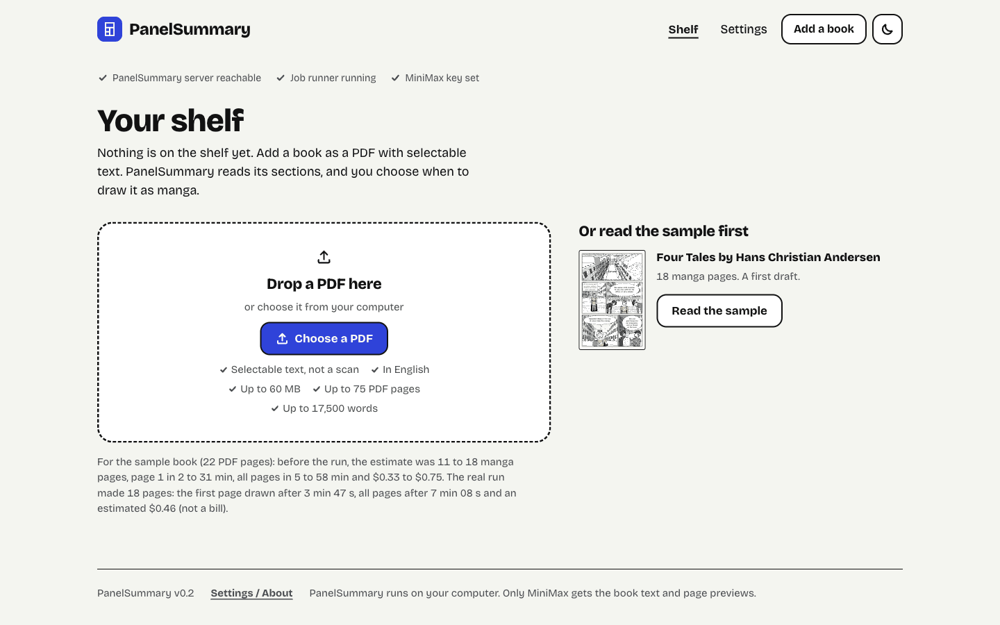
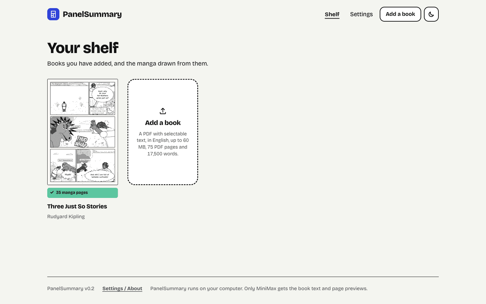
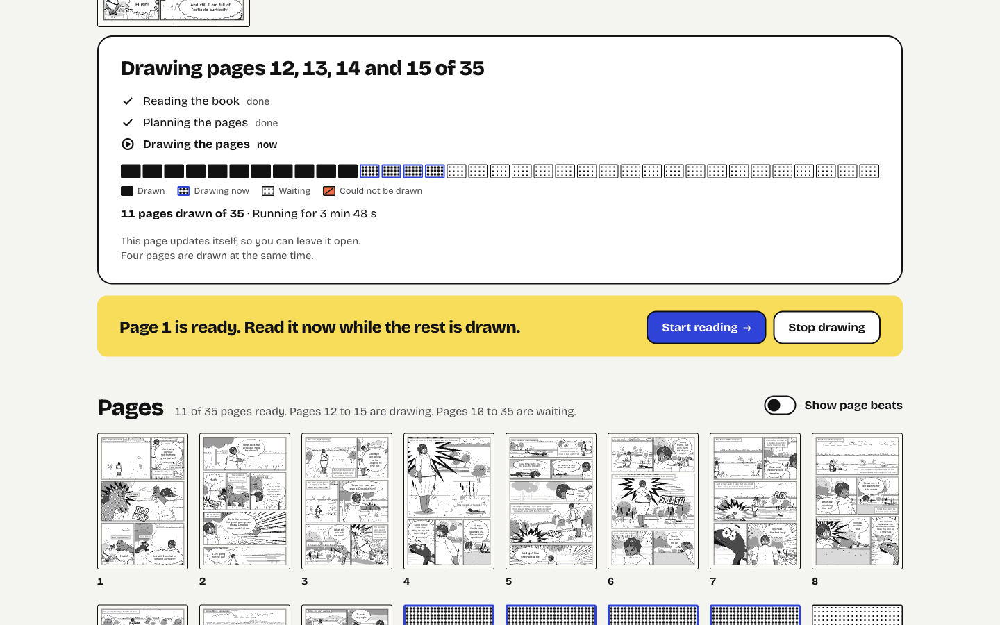
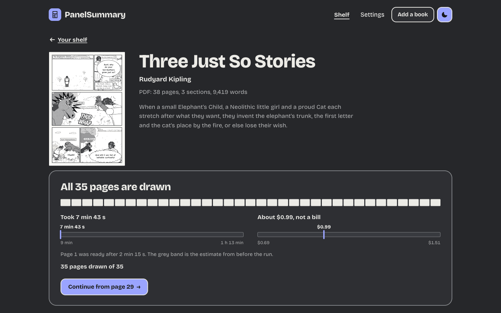
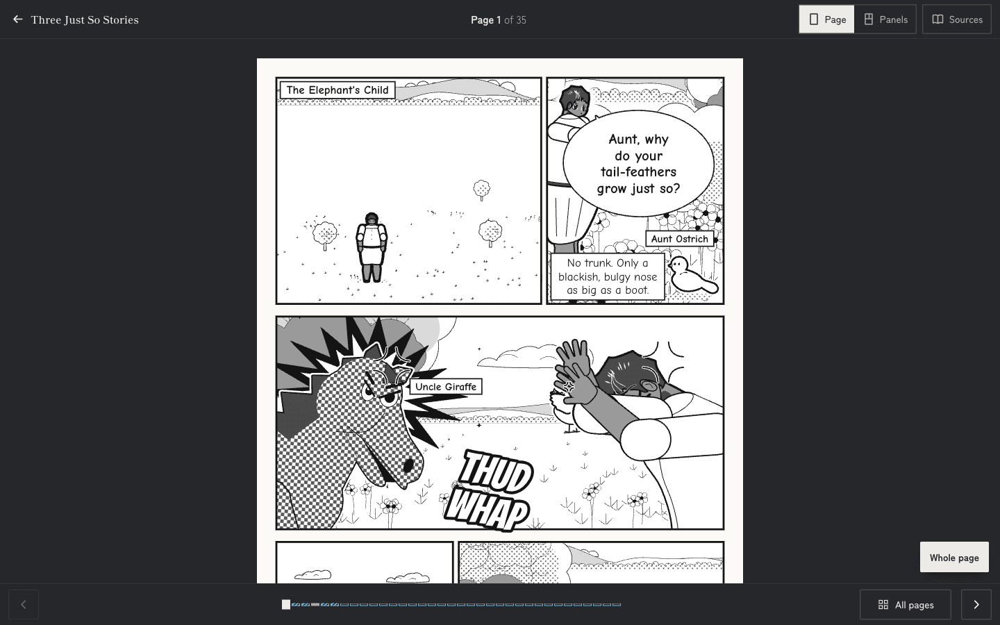

# PanelSummary (BookReel)

Upload a book PDF, press **Generate manga**, and read a source-grounded manga adaptation of it.

PanelSummary reads the whole book, plans how it becomes pages, and writes each page as a
structured plan (panels, camera, characters, lettering). A deterministic renderer draws
every page as ink-and-screentone SVG: characters, places, props, effects, balloons and
lettering are all code. No image-generation model is used. Every page records which parts
of the book it adapts, and the reader can show them.

This is version 0.2. It has a new app interface, a choice of what part of the book to draw,
an optional review of the plan before drawing, a built-in sample, a larger reader page on
desktop and a page picker. [`docs/v0.2/README.md`](docs/v0.2/README.md) lists the v0.2 documents.

| The first run | The shelf |
|---|---|
|  |  |

## How it works

```text
PDF ──► parse job ──────────► sections + page-true source units          backend (PyMuPDF)
          │
Generate ─┼─► BOOK_UNDERSTANDING  cast + looks, places, claims            ┐
          ├─► ADAPTATION_PLAN     pages, beats, claim → page ledger       │ MiniMax through the
          └─► MANGA_PAGE × N      one session per page, 4 in parallel:    │ sealed Pi harness
                                  preview (rendered PNG, vision) → submit ┘ (apps/agent-worker)
                                  submit = validate + render SVG           packages/manga-render
          ▼
MongoDB: edition, artifacts, pages (spec + SVG + panel geometry + receipts)
          ▼
Reader: shows the persisted SVG; panel mode moves the camera over the stored geometry
```

- **One path to the model.** Every MiniMax call goes through `apps/agent-worker`, which runs
  a sealed Pi session (`packages/agent-runtime`, Pi 0.80.10 pinned): no built-in tools, no
  ambient files, only the goal's domain tools, source text tagged as untrusted data, and
  limits on turns, tool calls, submissions, cost and time. The backend never holds the key.
- **Goals and tools.** Understanding and plan submit one JSON candidate each; a validator
  replies `ACCEPTED` or lists every error to fix. A page goal can `preview_page` (the
  renderer's issues plus the rendered PNG for M3 vision) before `submit_page`.
- **Visible failure.** A page that fails every attempt is stored as `failed` with its
  reason and shown as a failed page. An edition with failed pages ends
  `completed_with_failures`, and the coverage report lists the claims those pages carried.
  Resume redraws only failed or pending pages; nothing accepted is paid for twice.
- **Faithfulness.** Every lettered line is labelled `quote`, `paraphrase`, `dramatized` or
  `metaphor`, and every panel cites its source units and PDF pages. The reader's Sources
  drawer shows them.

The generation policy (models per goal, thinking levels, retries) came from measured
experiments: [`docs/rebuild/EXPERIMENTS.md`](docs/rebuild/EXPERIMENTS.md). The current policy is
decision D13 in [`docs/decisions.md`](docs/decisions.md). That file also holds every other
decision and its reason. The launch notes are indexed in
[`docs/launch/README.md`](docs/launch/README.md). The v0.2 documents are indexed in
[`docs/v0.2/README.md`](docs/v0.2/README.md).

## Requirements

- macOS or Linux.
- Node 22.19 or newer, and pnpm 10.15.1 (`corepack enable` gives you the pinned pnpm).
- Python 3.12 and `uv`. Use 3.12 exactly. See step 2 below.
- `mongod` (for example `brew install mongodb-community`), unless you set
  `PANELSUMMARY_MONGODB_URL`.
- To draw your own books: a MiniMax API key (Anthropic-compatible endpoint). `start.sh` looks for
  it in this order: `$MINIMAX_API_KEY`, then `backend/.env` (`MINIMAX_API_KEY=`), then the macOS
  Keychain item `minimax_api_key`. It passes the key only to the agent worker and never prints it.
  `start.sh` stops with an error if it finds no key.
- No key is needed to read the built-in sample or to run the replay worker. See
  [Try it without a MiniMax key](#try-it-without-a-minimax-key).

## Run it

```sh
git clone https://github.com/Legend101Zz/PanelSummary
cd PanelSummary
git checkout v0.2.0                                         # the v0.2 release; main has the same code

# 1. Install the workspace and the frontend (start.sh does this too if you skip it)
pnpm install --frozen-lockfile
(cd frontend && npm ci)

# 2. Make the backend environment with Python 3.12
(cd backend && uv venv -p 3.12 && uv pip install -r requirements.txt)

# 3. Start, verify, stop
./start.sh     # starts everything, prints the URL
./check.sh     # status of worker, API, runner, frontend
./stop.sh      # stops only what start.sh started
```

Step 2 is not optional. If `backend/.venv` does not exist, `start.sh` runs a plain `uv venv`.
`uv` then picks the newest Python on your machine. With Python 3.14 the install of
`pydantic-core` fails to build. If a failed `start.sh` left a `backend/.venv` behind, remove it
(`rm -rf backend/.venv`) and do step 2. A later `start.sh` would skip the install because the
directory exists.

After `start.sh` prints the URL, open it. On a new database the first run must show (a status line
and "Drop a PDF here"). After that the shelf page ("Your shelf") shows. Also run
`curl http://127.0.0.1:8000/health`. It must answer `{"status":"ok", ...}`. The API documents
are at `http://127.0.0.1:8000/docs`.

| Service | Where |
|---|---|
| Frontend (the app and the reader) | http://127.0.0.1:3100 |
| API | http://127.0.0.1:8000 (docs at `/docs`) |
| Agent worker (MiniMax harness) | 127.0.0.1:8788 (token-protected, loopback only) |
| Job runner | `python -m app.runner` (no port) |
| MongoDB | 127.0.0.1:27018, data in `.dev/mongo` |

### Change the ports

Another program can use these ports. Set these variables to move the stack. Use the same values
for `./check.sh`, because it reads the same variables. `./stop.sh` needs none: it stops the
processes by the pid files in `.dev/pids`.

```sh
export PANELSUMMARY_WEB_PORT=3240 PANELSUMMARY_API_PORT=8140 \
       PANELSUMMARY_WORKER_PORT=8804 PANELSUMMARY_MONGO_PORT=27036
./start.sh
```

You can also set `PANELSUMMARY_DB_NAME` to use a different database name. Open the app at
`http://127.0.0.1:` and the web port. Never use port 3000. `start.sh` refuses it as the web port.
Do not stop or probe the process on it.

### Database

The stack uses its own local MongoDB. To use another database, set `PANELSUMMARY_MONGODB_URL`
(and optionally `PANELSUMMARY_DB_NAME`) before `./start.sh`. Never use the Atlas URL that can
be in `backend/.env`. Logs are in `.dev/logs/`.

Generation policy lives in `backend/app/settings.py` (environment-overridable, for example
`PAGE_MODEL`, `PAGE_THINKING`, `PAGE_VISION`, `PAGE_CONCURRENCY`, `PLAN_REVIEW_DEFAULT`) and is
recorded on every edition. See D13 in `docs/decisions.md` for the current values and the reasons.

## Try it without a MiniMax key

The replay worker answers like the real worker, but it plays back a saved run. The whole journey
(upload, parse, Generate, the run card, the reader) runs through the real backend and the real
screens. No model is called and nothing is spent. `start.sh` does not look for a key.

```sh
PANELSUMMARY_REPLAY_WORKER=scripts/fixtures/replays/happy-prince-two-tales ./start.sh
./check.sh      # says that the worker is the REPLAY worker
```

Then open the app, choose **Add a book** and upload the PDF that matches the package:
`scripts/acceptance/books/happy-prince-two-tales.pdf`. Press **Generate manga**. The run ends in
about one minute (48 seconds in the last check) with 22 pages. Use another PDF and the run fails with `REPLAY_BOOK_MISMATCH`.
The package `scripts/fixtures/replays/andersen-18` replays the Andersen run, but its PDF is not in
the repository. The built-in sample needs no replay: it is stored data.

A replay shows today's checks and today's renderer on a saved run. It says nothing about model
quality, speed or cost. Every receipt says provider `replay`. Options (delays, failing pages, a
MiniMax stop) are in [`docs/v0.2/F1-replay-worker.md`](docs/v0.2/F1-replay-worker.md). Stop the stack
with `./stop.sh`.

## Using it

1. **First run.** On an empty shelf the app shows three facts in one line: the server is reachable,
   the job runner runs, and the MiniMax key is set or not set. Below are a drop zone with every
   limit and, on the right, "Or read the sample first". If the server or the key is missing, the
   screen says what to do.
2. **Add a book.** Drop a born-digital PDF (selectable text, in English) or press "Choose a PDF".
   The limits are 60 MB, 75 PDF pages and 17,500 words for one run. Parsing takes seconds. The
   screen says what it read ("Read 22 PDF pages and found 4 sections.") and moves to the book page.
   A scan with no text layer is refused with the next step. A book that is already on the shelf is
   not added twice.
3. **The estimate.** The book page shows the size of the book, the limits, and a low and a high
   estimate of pages, cost and time. The estimate is a range from measured runs. It is not a quote.
   If the book is over a limit, you must choose a smaller part first (step 6).
4. **Generate manga.** One button starts the run. The run card names the stage (reading the book,
   planning the pages, drawing pages 12 to 15 of 35), the running time and a **tone strip**: one
   cell for each page. A cell is drawn, drawing now, waiting, or could not be drawn. The page
   updates itself, so you can leave it open. Four pages are drawn at the same time.
5. **The page 1 moment.** When page 1 is drawn, a yellow band says "Page 1 is ready. Read it now
   while the rest is drawn." with "Start reading" and "Stop drawing". Page 1 comes after the whole
   book is read and planned. In the runs shown here that took 2 to 4 minutes. A whole run took about 7 to 8 minutes. Earlier
   v0.1 runs took up to 30 minutes, depending on MiniMax output speed at the time.
6. **Choose what to draw.** "Draw only part of the book" opens a control. Choose one or more
   sections, or a range of PDF pages. The estimate and the limits follow your choice. A book over
   the limits can be drawn in parts: choose one part, then run the next part later.
7. **Review the plan (optional).** Turn on "Review the plan before drawing" in Settings. Generate
   then reads the book and makes the plan, and stops. The screen shows the page count, a cost
   range for drawing, the cast, one line for each page and the key points that the plan leaves
   out. Press "Draw the pages" to go on, or "Stop". The choice is off by default.
8. **Stop, resume, retry.** "Stop drawing" ends a run. "Resume drawing" continues it and redraws
   only the pages that are not accepted. "Retry failed pages" redraws only the failed pages.
   "Draw this page again" redraws one page. Nothing accepted is paid for twice.
9. **MiniMax stops.** If MiniMax refuses a call (a usage limit, a key that it refuses, or no
   answer), the run stops and the card says which. Fix the cause, then press "Resume drawing".
10. **Read.** "Start reading" opens the reader. Page mode on wide screens, panel mode (the camera
    steps panel by panel) on phones. On a desktop the page is shown at a larger "read size" so that
    captions are readable (about 15 px). It needs scrolling. "Whole page" shows the full page, as in
    v0.1. "All pages" opens a picker with a button for each page, in groups by section. Arrow keys,
    Space, swipe, tap zones, zoom and reduced motion work. The page number is in the URL.
11. **Sources.** The Sources drawer lists what the page conveys, each panel's PDF pages (links to
    the source viewer), and every line with its fidelity label.
12. **Settings.** Choose a light, dark or system theme. Settings also shows the server status, the
    models, the limits, what leaves the computer, and the plan review switch.
13. **The sample.** "Read the sample" on the first run installs the built-in edition "Four Tales by
    Hans Christian Andersen" (18 pages, public-domain text). It makes no model call. It is a real
    v0.1 run, so it shows the run's real cost and time, and it is a first draft.

| Drawing | Finished (dark) |
|---|---|
|  |  |



These screenshots are from a real v0.2 run of "Three Just So Stories" (35 pages), on a desktop
browser at 1440 pixels wide.

### What a failed page looks like

A page that fails every attempt is never hidden. On the book page it shows in the list of failed
pages with a plain reason and the technical detail. The shelf card and the progress text show a
red "N of M drawn, K missing" and the edition ends `completed_with_failures`. In the reader, the
page shows "This page could not be drawn", the reason, the number of failed pages, a "Retry
failed pages" button and a link back to the book. Retry redraws only the failed pages.

## Verify

No model calls, no spend. The backend tests need a MongoDB. They use
`$TEST_MONGODB_URL` (default `mongodb://127.0.0.1:27018`) and create their own databases. If you
moved the ports, point the tests at the MongoDB of your stack, for example
`export TEST_MONGODB_URL=mongodb://127.0.0.1:$PANELSUMMARY_MONGO_PORT`. Run the commands from the
repository root.

```sh
(cd backend && .venv/bin/python -m pytest tests -q)        # parser, static guards, offline journey, preflight, samples
(cd apps/agent-worker && npx tsc --noEmit && npx vitest run)   # includes the replay worker
(cd packages/agent-runtime && npx tsc --noEmit && npx vitest run)
(cd packages/manga-render && npx tsc --noEmit && npx vitest run)
(cd frontend && npx tsc --noEmit && npm test)
./stop.sh                                                  # the build below must not run while the stack runs
(cd frontend && npm run build)
```

`start.sh` runs `next dev` in `frontend/`. A production build in the same folder breaks it, so run
`npm run build` only after `./stop.sh`. The backend tests need the MongoDB, so run them before
`./stop.sh` (or start your own `mongod`).

GitHub Actions runs the same checks on every pull request into `release/v0.1`, `release/v0.2` and `main`. It
also has a manual lane for a live run with real MiniMax calls. See
[`docs/launch/CI.md`](docs/launch/CI.md).

- `backend/tests/test_generate_journey.py` drives upload → parse → Generate → page API against
  a fake worker and fails if Generate bypasses the worker, if the page API serves anything but
  the worker's exact SVG and geometry, if a failed page's claims vanish from coverage, if resume
  repeats accepted work, or if the backend contacts any other host.
- `backend/tests/test_static_guards.py` fails if an image-generation surface or a direct LLM SDK
  appears in the backend.
- `backend/tests/test_samples.py` verifies the built-in sample: install, idempotence and the API.
- `backend/tests/test_preflight.py` verifies the size limits and the preflight estimates
  against the measured runs.
- A live acceptance check against a running stack (real MiniMax calls) is described in
  [`docs/rebuild/ACCEPTANCE.md`](docs/rebuild/ACCEPTANCE.md). The quality judge harness is in
  [`docs/launch/EVAL.md`](docs/launch/EVAL.md).


## Repository layout

```text
backend/            FastAPI API, job runner, PDF parser (Python); backend/samples/ holds the built-in sample
apps/agent-worker/  MiniMax goals, skills, local tools, the replay worker, experiment CLI (TypeScript)
packages/agent-runtime/  sealed Pi session runtime (the only Pi import)
packages/manga-render/   deterministic renderer: contracts, validators, layout, rigs,
                         environments, props, fx, lettering, SVG, PNG preview
frontend/           Next.js: app screens in app/(app), reader and PDF viewer in app/(reader),
                    shared components in components/ui
scripts/acceptance/ live journey, run export, test books and the quality judge harness
scripts/fixtures/   state seeder (seed_states.py) and the saved runs for the replay worker
.github/workflows/  CI (ci.yml) and the manual live lane (live-journey.yml)
docs/               decisions.md, design/ (v0.2 design), v0.2/ (v0.2 track notes), launch/ (v0.1 notes),
                    rebuild/ (evidence), images/v0.2/ (README screenshots)
```

## Limits

The limits that the tracks measured are listed here. The detail is in
[`docs/launch/`](docs/launch/README.md) and [`docs/v0.2/`](docs/v0.2/README.md).

- **Book size.** A run draws up to 75 PDF pages and 17,500 words (decision D19). The limit
  applies to the part you choose. A longer book can be drawn in parts: choose sections or a range
  of PDF pages for each run. The largest book that finished end to end in the launch runs has 68
  PDF pages and 16,159 words. `POST /books/{id}/editions` refuses a larger run with HTTP 422 and a
  plain reason. It starts no job and spends nothing. Upload accepts any PDF that parses, up to 60
  MB. The limits are configuration (`MAX_PDF_PAGES`, `MAX_SOURCE_WORDS`). A slow MiniMax hour can
  still time out the understanding of a book that is inside the limits. The edition then fails
  with a visible reason.
- **Estimates are ranges.** Time and cost estimates come from measured runs. MiniMax output speed
  varied from 31 to 324 tokens per second across the runs. An estimate is not a bill.
- Born-digital PDFs only (no OCR).
- The drawn vocabulary is closed: characters, places, props and effects must map to what the
  renderer can draw. The model is told the vocabulary and validation rejects anything else.
- English, left-to-right pages by default (the layout compiler also supports right-to-left).
- A new section is not drawn on top of an earlier run. "Continue with the next section" is not in
  v0.2. Each run makes its own edition.
- **Page quality is uneven.** In the acceptance runs a panel of judge agents rated a minority of
  pages at the strict ship bar. The common faults are claims only partly shown, a character's state
  across pages, and props that the closed vocabulary draws loosely. See
  [`docs/rebuild/ACCEPTANCE.md`](docs/rebuild/ACCEPTANCE.md) and the track notes in `docs/launch/`
  and `docs/v0.2/`. The built-in sample is a v0.1 run, not a v0.2 run.
- **What leaves the computer.** Only the book text and page previews go to MiniMax, through the
  worker. The app makes no other third-party request: the fonts are in the repository and
  Next.js telemetry is off.
